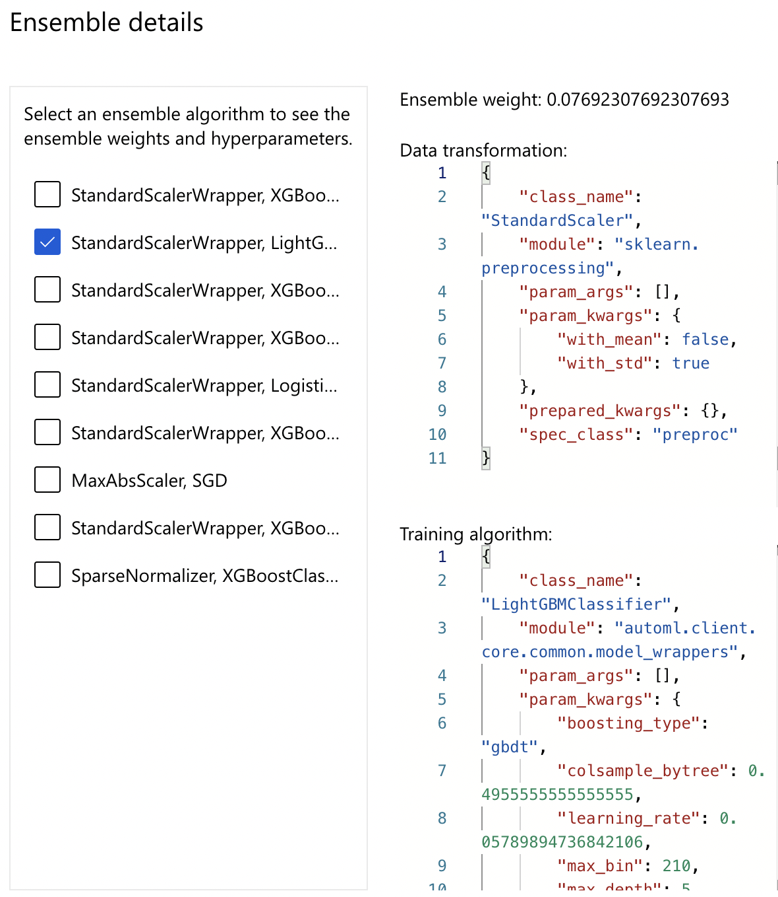

# Optimizing an ML Pipeline in Azure

## Overview
This project is part of the Udacity Azure ML Nanodegree.
In this project, we build and optimize an Azure ML pipeline using the Python SDK and a provided Scikit-learn model.
This model is then compared to an Azure AutoML run.

## Useful Resources
- [ScriptRunConfig Class](https://docs.microsoft.com/en-us/python/api/azureml-core/azureml.core.scriptrunconfig?view=azure-ml-py)
- [Configure and submit training runs](https://docs.microsoft.com/en-us/azure/machine-learning/how-to-set-up-training-targets)
- [HyperDriveConfig Class](https://docs.microsoft.com/en-us/python/api/azureml-train-core/azureml.train.hyperdrive.hyperdriveconfig?view=azure-ml-py)
- [How to tune hyperparamters](https://docs.microsoft.com/en-us/azure/machine-learning/how-to-tune-hyperparameters)

## Summary
**Problem statement:**

The dataset contains information from a bank marketing campaign. The problem is a binary classification problem where we need to predict whether the client subscribed for a term deposit(y) or not(n). The target column is represented by 'y' in the given dataset.  Source of information: UCI ML Repository

**Solution:**

The best performing model was a VotingEnsemble model trained by the AutoML feature of AzureML. It had accuracy of 91.7%.

## Scikit-learn Pipeline
**Explain the pipeline architecture, including data, hyperparameter tuning, and classification algorithm.**

The scikit-learn pipeline consists of the following stages:
1. Fetching the data from the remote URL
2. Cleaning the data
3. Splitting the data into train and test sets
4. Hyperparameter Tuning on a Logistic Regression classifier using Hyperdrive python package of AzureML

**What are the benefits of the parameter sampler you chose?**

- I chose RandomParameterSampling. 

- Hyperparameter values are randomly selected from the defined search space. 

- It allows the search space to include both discrete and continuous hyperparameters. 

- It greatly reduces computation costs and speeds up the parameter space exploration.

**What are the benefits of the early stopping policy you chose?**

- I chose BanditPolicy. 

- The policy early terminates any runs where the primary metric is not within the specified slack factor/slack amount with respect to the best performing training run. 

- This prevents certain unnecesary Runs from consuming compute resources. 

- It allows us to define a minimum required improvement to continue with the parameter search.

## AutoML
**In 1-2 sentences, describe the model and hyperparameters generated by AutoML.**

The best model generated by AutoML is a VotingEnsemble model, with accuracy 91.7%.
We can view the hyperparameters of the ensemble from this:

## Pipeline comparison
**Compare the two models and their performance. What are the differences in accuracy? In architecture? If there was a difference, why do you think there was one?**

The best model generated with Hyperdrive optimization is a Logistic Regression model, with accuracy 91%.
The best model generated by AutoML is a VotingEnsemble model, with accuracy 91.7%.
VotingEnsemble is a soft voting ensemble created from previous AutoML iterations.
There is a minor difference of 0.7% in accuracy, which is not significant.

If Ensemble was not used, the best model would be "StandardScalerWrapper XGBoostClassifier" with 91.34% accuracy. 

## Future work
**What are some areas of improvement for future experiments? Why might these improvements help the model?**

1. Add additional parameters to AutoMLConfig
2. Give more choices for the hyper-parameters inside RandomParameterSampling, i.e. for C and max_iter
3. Try other Parameter Sampling techniques in Hyperdrive
4. Try other Early Stopping policies in Hyperdrive
5. Train Deep Learning models instead of Logistic Regression, they are capable of improving accuracy further. Also include deep learning models in the AutoML feature
6. We noticed that there is class imbalance in the dataset. By using over-sampling techniques on the minority class, we can bring about class balance, and this could potentially improve model performance. 
7. Perform additional data processing such as normalisation, standardisation etc. as required
8. It might help to store the data permanently in our Datastore. Currently, we are directly bringing the data from the remote URL to our notebook. In future:

            => if the data changes in the remote URL, the results would vary. We need to be able to associate model performance with the corresponding data that was used. 

            => Also, if the URL does not work in future, it becomes problematic. 

## Proof of cluster clean up
**If you did not delete your compute cluster in the code, please complete this section. Otherwise, delete this section.**
**Image of cluster marked for deletion**

Cluster clean up is handled in the code. 
